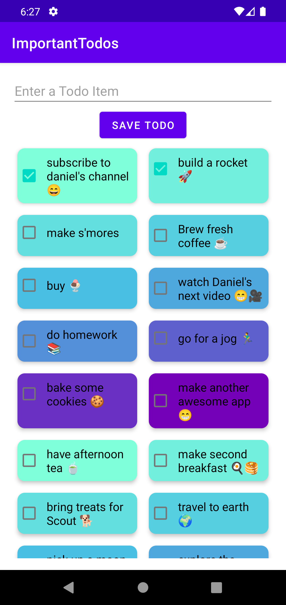
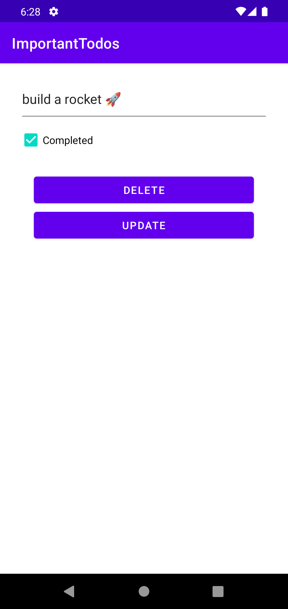

# ImportantTodos

A simple Android todo list app to learn MVVM and other common Android frameworks.

Watch the YouTube videos here:
- [Room Database](https://youtu.be/Md0tFv4PmuM)
- [RecyclerView](https://youtu.be/RhL7_pDl07w)
- [DiffUtil and RecyclerView Navigation](https://youtu.be/MM2h7cRV7TY)
- Writing Automated Tests:
  - [Overview of Android Automated Testing](https://youtu.be/d8FrwMZs74s?si=ZVhXjJ1YDIyZQwwP)
  - [Unit Testing for Beginners](https://youtu.be/O8lBbmAj5Ac?si=-K6Xu37PjcLcXks-)
  - [Testing the DAO](https://youtu.be/KI1btlExM50)

## Screenshots
 
 

### License
[MIT](https://choosealicense.com/licenses/mit/)
